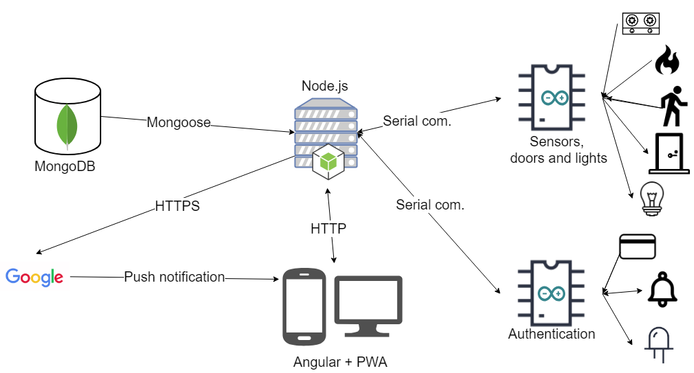
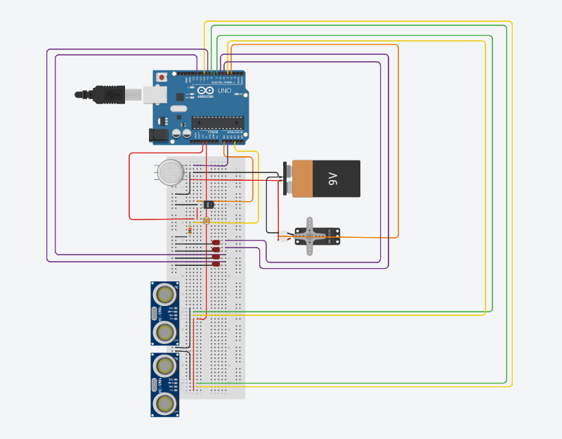
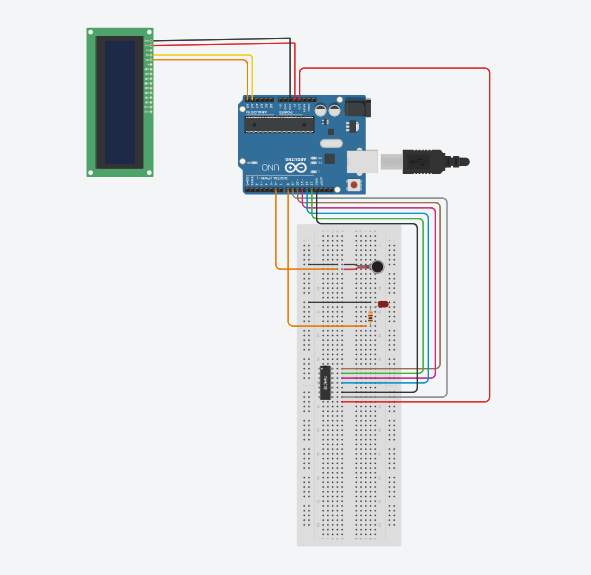

# HackMK - 24h hackathon (2019 march)

### Team name: **Giants and Hobbits**

### Project name: **Secure_IT**

### Team members:

- Vass Tekla
- Dénes Tamás
- Fodor Lóránt
- Patakfalvi Örs-Krisztián

### Topic and ideas

- chosen topic: **SAFETY**
- creating a **smart home security system**
- using **NFC cards** instead of keys and pin based arming
- showing that creating a basic system can be done **DIY at affordable price**

### About the project functionalities

- NFC card: authentication (door lock)
- NFC card: arm and disarm the security system
- Application: system configuration
- Notification on events and alerts:
  - wrong card
  - fire / motion / methane leaking alert
- History: entry and event

### Software architecture

### Hardware architecture

#### Arduino sensor panel

#### Arduino authentication panel

### Demo

